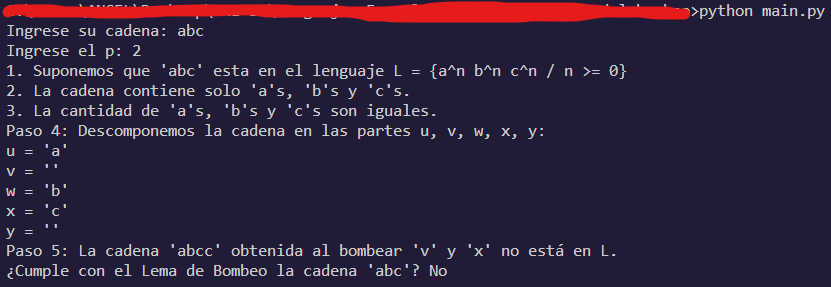

# Lema del bombeo para lenguajes sensibles al contexto

---

1. [Introducción](#introducción)
1. [Instalación](#instalacion)
1. [Requisitos del sistema](#requisitos-de-sistema)
1. [Uso del programa](#uso-del-programa)
   - [Interfaz de usuario](#interfaz-de-usuario)
   - [Ejemplo de Uso](#ejemplo-de-uso)
   - [Testing](#testing)
1. [Soporte técnico](#soporte-técnico)
1. [Tiempo de respuesta](#tiempo-de-respuesta)
1. [Contribuidores](#contribuidores)

---

## Introducción

El lema de bombeo para lenguajes sensibles al contexto es una herramienta poderosa en esta búsqueda. Similar al lema de bombeo para lenguajes libres de contexto, este lema establece una condición necesaria para que un lenguaje sea considerado sensible al contexto. Específicamente, establece que si un lenguaje es sensible al contexto y lo suficientemente largo, entonces contiene una "cadena bombeable", que puede ser repetida manteniendo su pertenencia al lenguaje.

En especifico, este programa aplica el Lema de Bombeo para el lenguaje L = {a^n b^n c^n / n >= 0}.

## Instalacion

1. Clona el repositorio:

   ```bash
   git clone https://github.com/angelchavezinformatica/pomping_lema.git
   cd pomping_lema
   ```

## Requisitos de Sistema

- Python 3.9 o superiores.
- Compatible con todos los sistemas operativos que puedan ejecutar python 3.

## Uso del Programa

### Interfaz de usuario

- Ejecutando el siguiente comando en el directorio del programa puede empezar a usar el programa.

  ```bash
  python main.py
  ```

### Ejemplo de Uso



### Testing

- Ejecutando el siguiente comando puede testear el programa.

  ```bash
  python main.py --test
  ```

## Soporte Técnico

### Plataforma de Soporte

- Correo Electrónico: achavezg@unitru.edu.pe

## Tiempo de Respuesta

Haremos todo lo posible para responder a tus consultas en un plazo de 48 horas.

¡Gracias por utilizar nuestro Analizador léxico simple!

### Contribuidores

- Chávez García Angel Emanuel
- Mostacero Bazan Kevin Alejandro
- Sánchez Abanto Félix Aladino
